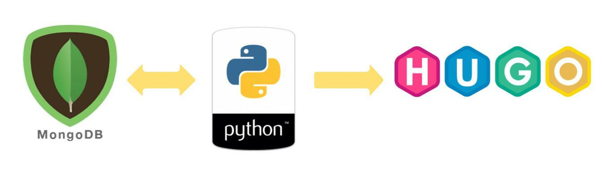
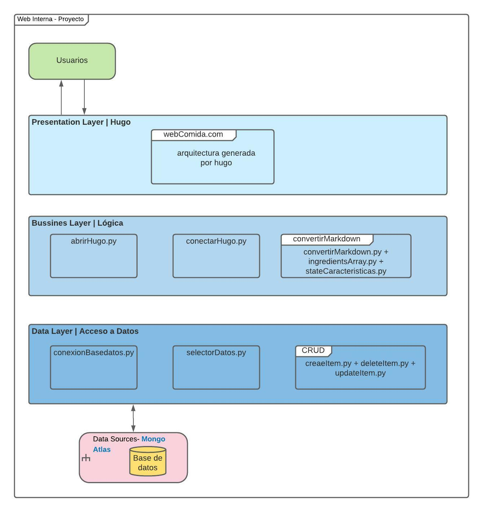
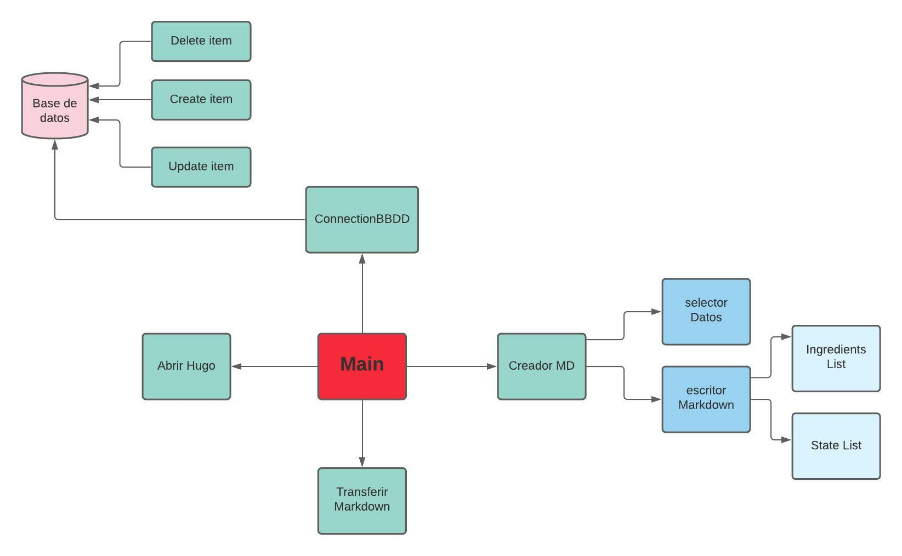
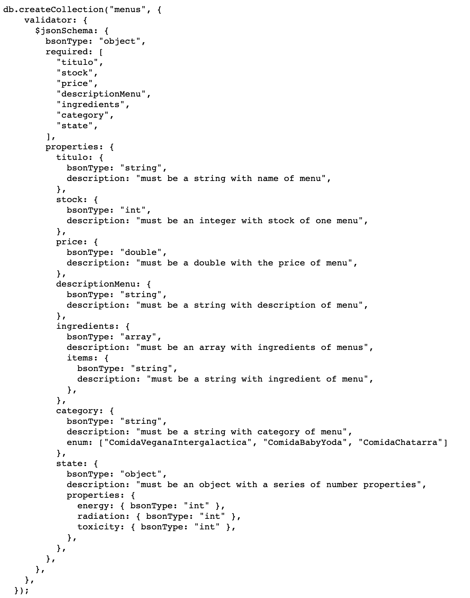
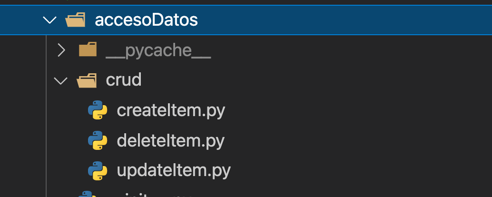
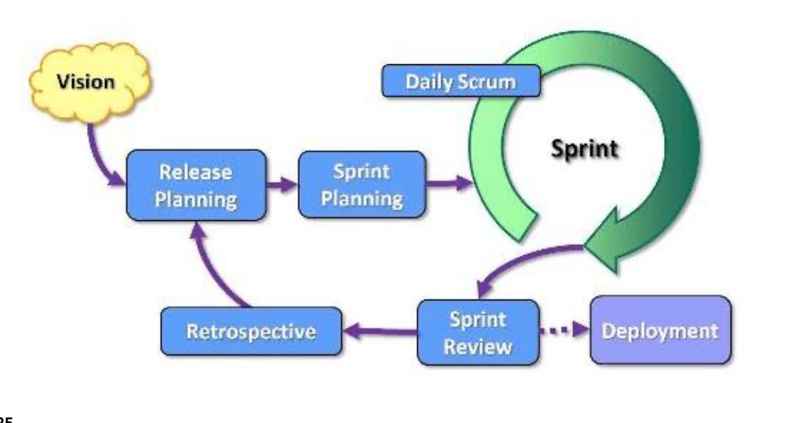
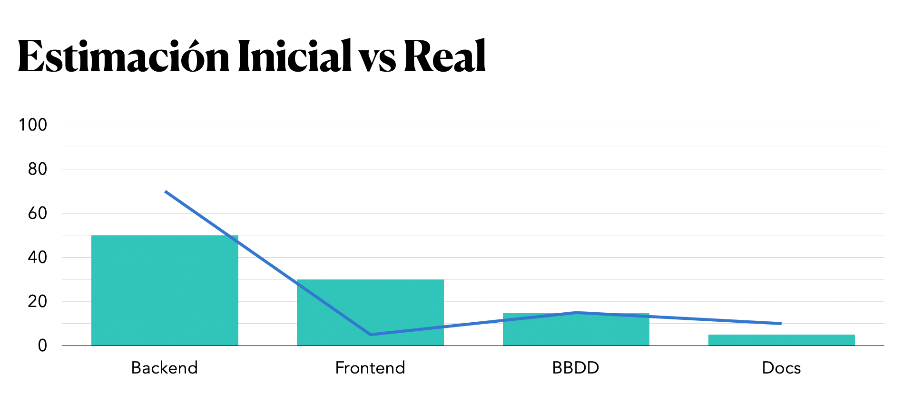

# **PROYECTO PYDEVOPS**
#### ***Ramón Sánchez & Leslie Aranibar***  *1r DAW DUAL* 
-------
***Índice:***

1. Introducción
   * Descripción del reto
   * Análisis de los objetivos   
2. Demostración del funcionamiento del proyecto
3. Ánalisis 
    * Posibles tecnologías encontradas
    * Tabla de tecnologías y requisitos
    * Primer diagrama general
4. Descripción técnica 
*  *Diseño*
    * Arquitectura de la applicación
    * Diagrama de compontes y sus funcionalidades
    * Esquema BBDD
    * Futuras pruebas
  * *Implementación*
    * Tecnologías y herramientas utilizadas 
    * CRUD
    * Frontend
5. Pruebas
   * CRUD
   * TDD
6. Metodología de desarrollo utilizada
7. Clockify del desarrollo de la app 
   * Diagrama del trabajo hecho
   * Análisis y justificación del tiempo invertido
8. Comparación temporal
9. Conclusiones 
  * Principales dificultades encontradas
   * Futuras mejoras 
10. Turno de preguntas
---
## **1. Introducción**

**- Descripción del Reto:**  
El desafío que mi equipo abordó resolutivamente, en esencia, consiste en la refactorización de la web interna de una empresa determinada. La cuál era hecha con Wordpress y presentaba ciertas flaquezas. Sobretodo en los procesos de CRUD en su stock.

De manera que nosotros debemos de encargarnos de implementar un sistema de integración y entrega contínua (CI/CD) y mejorar, tanto el funcionamiento y la estética, de su web interna. Todo eso haciendo uso de los conocimientos adquiridos de Python, CSS y de BBDD.

Por suerte, el último becario pasó los ítems a documentos JSON. Y gracias a él, este es el punto de partida del trabajo de nuestro equipo.

**- Análisis de los objetivos:**

Los objetivos clave de este proyecto son:

1. Desarrollar una applicación Python para extraer los datos de MongoAtlas, diseñando una especificación del esquema de los  documentos JSON. 
   
2. Otra aplicación Python que transforme los documentos JSON en ficheros Markdown.
3. Una tercera aplicación Python que sitúe los ficheros MD en la estructura de directorios que establece el generador de contenidos estáticos HUGO
4. Personalizar los estilos CSS para que la empresa disponga de una web única y hermosa. 
5. Implementar las funcionalidades de CRUD. Para que cualquier cambio que la empresa realice sobre un ítem de la base de datos se actualice automátiamente en su web simplemente lanzando el sistema que hemos desarrollado. 
---
## **2. Demostración del funcionamiento del proyecto**

A continuación ejecutaremos nuestro programa des de el *main.py* para demostrar que cumple con todos los objetivos vistos préviamente. Y satisfae las necesidades que demandaba la empresa. 

---
## **3. Análisis**
* **Posibles tecnologías**

Para desarrollar este proyecto podríamos escoger entre distintas opciones.

Para empezar, existene diferentes editores de código, como por ejemplo: *Nova, Atom, Sublime, Vim,etc.*. Y entre todos esos, nos hemos decantado por el *Visual Studio Code*. Ya que ambos nos sentíamo más cómodos y familiarizados usando este editor. 

Luego, para trabajar en equipo y comunicarnos seleccionamos las applicaciones: Whastapp y Discord. También podríamos seguir usando *Slack*, pero ambos no lo revisamos con mucha frecuencia.

Por último hay tecnologías establecidas para este proyecto, las cuáles son de uso obligatorio para cumplir con los objetivos. Como es el caso de: 

*Python*, ya que es el lenguaje que hemos estado aprendiendo durante estos últimos meses y del cuál nos evaluan. 

Después tanto *Hugo y MongoDB* son herramientas que también han sido definidas en la presentación del reto.

* **Tabla de tecnologías y requisitos**

|                                                                 Requisitos/ Objetivos                                                               | Tecnologías |        |      |          |       |                       |                    |        |        |     |            |                     |
|:---------------------------------------------------------------------------------------------------------------------------------------------------:|:-----------:|--------|------|----------|-------|-----------------------|--------------------|--------|--------|-----|------------|---------------------|
|                                                                                                                                                     | MongoAtlas  | Python | Hugo | Discord  | Black | Conventional  Commits | Google Formularios | Pytest | GitHub | API | Live Share | Librerías de Python |
| 1. Desarrollar una applicación Python  para extraer los datos de MongoAtlas,  diseñando una especificación del esquema  de los documentos JSON.     |      X      |    X   |      |     X    |       |           X           |                    |    X   |    X   |     |      X     |          X          |
| 2. Otra aplicación Python que transforme  los documentos JSON en ficheros Markdown.                                                                 |             |    X   |      |     X    |   X   |           X           |                    |    X   |    X   |     |      X     |          X          |
| 3.Una tercera aplicación Python que sitúe  los ficheros MD en la estructura de directorios que establece el generador  de contenidos estáticos HUGO |             |    X   |   X  |     X    |   X   |           X           |                    |    X   |    X   |     |      X     |          X          |
| 4. Personalizar los estilos CSS para que  la empresa disponga de una web única.                                                                     |             |        |      |          |       |                       |                    |        |        |     |            |                     |
| 5. Implementar las funcionalidades de CRUD.                                                                                                         |      X      |    X   |   X  |     X    |   X   |           X           |          X         |    X   |    X   |  X  |      X     |                     |

* **Primer diagrama general**

Como primer diagrama general del reto, debemos:
1. Crear unos scripts python que esten vinculados con una base de datos en MongoAtlas (para poder realizar operaciones de CRUD en ella).
2. Hacer documentos Markdown con esa información, automatizados con Python.
3. Enviar los MD y visualizarlos con HUGO.
   
Tal como podemos ver en el siguiente diagrama general y simplificado.

---
## **4. Descripción técnica**
* ### *Diseño*
  * **Arquitectura de la applicación:** 
  
  La arquitectura por capas de nuetro proyecto es la siguiente:

Encontramos principalmente 3 niveles/capas colocadas de manera horizontal. Cada capa realiza una única función definida. Ya que la arquitectura basada en capas se enfoca en la distribución de roles y responsabilidades de forma jerárquica proveyendo una forma muy efectiva de separación de responsabilidades

 Y su comunicación es directa e inmediata con la capa que está por debajo de ellas, por lo que, si una capa quiere comunicarse con otras que están mucho más abajo, tendrán que hacerlo por medio la capa que está inmediatamente por debajo. 

 Las capas que ocupan una posición más abajo están más conectadas con el Backend del software y las que están más arriba son cercanas y directamente relacionadas con los usuarios. Es por eso que en la última capa es la encargada de la conexión y acceso a los datos. En en lugar intermedio, localizamos la capa de la lógica del proyecto, que alberga todos sus diferentes submódulos. Y finalmente, arriba de todo vemos la capa de la presentación,  con el rol de presentar ,de manera estética y visual, la información a las usuarias. 

 Paralelamente, al costado derecho, podemos obsrvar la capa de servicios externos o herramientas externas que hemos necesitado utlizar para desarrollar la web interna. 

*   **Diagrama de compontes y sus funcionalidades:**

La arquitectura del sistema de nuestra aplicación es modular. Cada módulo es independiente de los demás, de manera que presenta la lógica un bajo acoplamiento. Pero se encuentran todos conectados en el main.py y son ejecutados a la vez. 

Nuestras barricados las encontramos en los módulos dónde hemos utlizado las siguientes librerías: *Pymongo, Os, Shutill, Webbrowser y Certifi.* Ya que por algún error que se presente en ellas impedirá la ejecución de dichos módulos.

Nuestro diagrama de componentes consta de los siguientes módulos :

|          Módulo         |                                                                                                                              Proposito                                                                                                                              |
|:-----------------------:|:-------------------------------------------------------------------------------------------------------------------------------------------------------------------------------------------------------------------------------------------------------------------:|
| Main.py                 | Recoge y ejecuta todos los otros módulos, por lo tanto depende de los demás.                                                                                                                                                                                         |
| conexionBasedatos.py    | Conecta con la base de datos almacenada en MongoAtlas.                                                                                                                                                                                     |
| selectorDatos.py     | Divide los ítems según su categoria y crea una lista python para su posterior manipulación.                                                                                                                                                                                               |
| convertirMarkdown.py    | Transforma la lista de 9 diccionarios de la misma categoria en un solo archivo markdown, mediante dos funciones. Utiliza dos funciones más (selectorDatos y escritorMarkdown), con estas obtiene la lista con los 9 diccionarios pertenecientes a la misma categoria y los escribe todos en un mismo archivo MD.                                                                                                                                                                                                                                             |
| ingredientsArray.py     |   Transforma el array que le pasa el valor de *ingredients* y los transforma en un solo string, para su posterior manipulación para dar estilo cuando se escriban en los MD.                                                                                                                                                                                                                                                           |
| stateCaracteristicas.py |         Transforma el diccionario que le pasa el valor de *state* y los transforma en un solo string, para su posterior manipulación para dar estilo cuando se escriban en los MD.                                                                                                                                                                                                                                                                |
| conectarHugo.py         | Traslada los archivos que se encuentran en la carpeta origen a la ruta destino deseada. En este caso es en el Post>Content>webComida.com, para que el gestor  de sitios estáticos lo publique. Depende de los archivos Markdown convertidos creados por ese módulo. |
| abrirHugo.py            | Se posiciona dentro de la web con Hugo. Luego abre una ventana en el navegador  predeterminado de cada ordenador y ejecuta en la terminal el comando para ver la web.                                                                                               |
                                             

*   **Esquema de BBDD**

El esquema de base de datos que hemos configurado es estricto. Por lo tanto, rechaza cualquier ítem o documento que no siga la patrón establecido. Y nuestro esquema es el siguiente:

*   **Futuras pruebas**

* ### *Implementación*
  * **Tecnologías y herramientas utilizadas:**

Para desarrollar el proyecto nosotros hemos hecho uso de las siguientes herramientas:
|      Herramientas     |                         Funcionalidad                         |
|:---------------------:|:-------------------------------------------------------------:|
| Visual Studio Code    | codificar                                                     |
| Linter en VSC         | visualizar errores                                            |
| Conventional Commits  | proporciona mas significado y legibilidad a los commits       |
| Git Hub               | para compartir y trabajar juntos                              |
| Git Graphs            | permite ver el historial y el esquema de las ramas de trabajo |
| Live Share            | codificar conjuntamente                                       |
| Black                 | corrector de la sintaxis de programación                      |                                                                                       |
| Hugo                  | gestor de sitios estáticos                                    |
| Python                | lenguaje de programación                                      |
| Mongo Atlas           | servicio global de base de datos de documentos en la nube     |
| Google Formularios    | para hacer formularios                                        |
| Discord y Whastapp              | conectarnos y hacer dailys                                    |

* ### *CRUD*
  Por ahora, hemos incluído las funcionalidades CRUD a través de scripts Python individuales. Cada uno realiza solo 1 función, es decir, són modulares. Durante estas vacaciones trabajaremos en hacerlo mediante formularios de Google para que la usuaria pueda realizar todas las operaciones  que desea únicamente desde la web interna de su empresa. Para poder llevarlo a cabo, usaremos también una API de google, llamada *Google Sheets*.

  Dichos scripts en el directorio del proyecto los encontramos en la carpeta *acceso a datos* y luego allí tenemos el folder *crud* 
  
  

  Como la imagen muestra, contiene 3 archivos python, y, como bien describe su nombre, realiza las funciones de update, create, y delete. 
  Esos archivos estan vinculados con la BBDD y utilizan la libreria *Pymongo* para poder realizar las operaciones.  

* ### *Frontend*
  
En el Frontend utilizamos una plantilla de *Hugo*, concretamenente: "anatole-master".

*Hugo* es un gestor de contenidos estáticos, el cuál nos permite descargar y utilizar muchísimas plantillas de su web desarrolladas por la compañia o de otros usuarios.

Esta plataforma nos ahorró bastante tiempo en cuanto a los estilos CSS y su gran variedad permite encontrar una dieño web idóneo para nuestra temática de restaurante.

Nosotros nos dencantamos por *Anatole-master*, ya que es una plantilla sencilla, responsive y minimalista. Durante la ejecución del proyecto utilizamos distintas plantillas pero algunas nos dieron problemas
#### Confirguración CSS/HTML
El desafío que mi equipo abordó resolutivamente, en esencia, consiste en la refactorización de la web interna de una empresa determinada. La cuál era hecha con Wordpress y presentaba ciertas flaquezas. Sobretodo en los procesos de CRUD en su stock.
De manera que nosotros debemos de encargarnos de implementar un sistema de integración y entrega contínua (CI/CD) y mejorar, tanto el funcionamiento y la estética, de su web interna. Todo eso haciendo uso de los conocimientos adquiridos de Python, CSS y de BBDD.
Por suerte, el último becario pasó los ítems a documentos JSON. Y gracias a él, este es el punto de partida del trabajo de nuestro equipo.
- Análisis de los objetivos:
Los objetivos clave de este proyecto son:
1- Desarrollar una applicación Python para extraer los datos de MongoAtlas, diseñando una especificación del esquema de los documentos JSON.
2- Otra aplicación Python que transforme los documentos JSON en ficheros Markdown.
3- Una tercera aplicación Python que sitúe los ficheros MD en la estructura de directorios que establece el generador de contenidos estáticos HUGO
4- Personalizar los estilos CSS para que la empresa disponga de una web única y hermosa.
5- Implementar las funcionalidades de CRUD. Para que cualquier cambio que la empresa realice sobre un ítem de la base de datos se actualice automátiamente en su web simplemente lanzando el sistema que hemos desarrollado
#### Cambios en el CSS/HTML
Hemos realizado diversos cambios en la estructura del CSS/HTML:
- Cambio de color en el hover de las diversas categorias de los menús.
- Cambio de color en el hover de las diversas redes sociales.
- Hemos reemplazado la foto de perfil por una de comida que va acorde con nuestro proyecto.
- Cambios de las url de los iconos de las redes sociales.
- Hemos realizado cambios en el header, hemos escrito el title de nuestra página web *Comida Galáctica*.
- Creación y modificación del los nombres de los menús, que nos llevan a otras páginas que contienen los archvios markDown.

---
 ## **5. Pruebas**
 * ### *CRUD*
  
  Todas nuestras operacionese (*Insert, update, delete*) las hacemos desde los scripts de python que estan vinculados con la base de datos. Para demostrar su funcionamiento, a continuación insertaré 3 vídeos cortos con ítems de ejemplo. 
  ***Aviso:*** **como los videos de los ejemplos pesan mucho, insertaremos sus enlaces en youtube para visualizarlos** 

##### 1r Ejemplo: insertar
  En el primer ejemplo, insertaré un nuevo documento, llamado *John*, a la coleción de *menus_with_schema* siguiendo el esquema establecido. El documento a insertar lo escribimos en el apartado correspondiente del script y una vez hecho, ejecutamos el programa. En la terminal no nos saldrá ningún error puesto que hemos seguido el esquema, más bien aparece un mensaje de éxito para indicar a la usuaria que la operación se ha completado bien. Para  comprobarlo buscaremos el nuevo documeto insertado en la base de datos. 

  Y a continuación, experimentamos insertar un documento que no sigue el esquema para que nos de error.
  
  https://youtu.be/ar55MSpDwxI

  ##### 2n Ejemplo: actualizar

  En este caso vamos a cambiar la descripción del documento *John*, por *Comida riquíssima*, mediante el script de *updateItem.py*
  
  https://youtu.be/Z_g_9zGI8js
  
  ##### 3r Ejemplo: eliminar
  Aquí vamos a proceder a eliminar el documento *John* sobre el cual hemos estado haciendo nuestras pruebas, utilizando en este caso el script de *deleteItem.py*
  https://youtu.be/SgA-ZZcUfPI
---
 ## **6. Metodología de desarrollo utilizada**
La metodología de desarrollo que hemos seleccionado conjuntamente es la SCRUM. Porque nos desenvolvemos bien dentro de este marco de proceso ligero y ágil. 

Este modelo intenta construir un mejor enfoque para manejar el desarrollo de software. Tiene una menos documentación que los otros métodos tradicionales y esto hace que sea menos complicado. Consta de un programa corto y fijo por ciclos con alcance ajustable, llamados sprints. Y cuenta con eventos, hitos y reuniones que se repiten.

El *Product owner* es David (tutor), el rol del *Scrum Master* nos lo hemos ido relevando, de un sprint a otro. Y el*Scrum team* somos nosotros: Ramón y Leslie.

Y para la organización del trabajo y potenciar nuestra productividad hemos utilizado la herramienta *Notion*. Gracias a esta herramienta hemos definido todo el backlog junto con sus historias de usuario correspondientes. Además hemos organizado el desarrollo del trabajo en 5 sprints con objetivos específicos, mesurables, alcanzables, relevantes y temporales, de acuerdo con el principio *SMART*. 
Por  otra parte, con la finalidad de llevar un ritmo de trabajo sincronizado, contamos con un calendario compartido dónde se visualiza la vida temporal de los *Epics* y algunas fechas destacables (como los *Sprint review meeting, Scrum retrospective meeting, etc.*)

Una pestaña que nos fué muy útil es la de *Task by Status*, la cual nos permitía ver el estado de las tareas de los sprints. Dividimos las tareas en 4  columnas: 
*  *Not started*: tareas por hacer
*  *In progress*: tareas que se estan haciendo.
*  *Completed*: tareas finalizadas
*  *Bugs:* tareas que tienen problemas o errores que hay que arreglar

De esta manera, la comunicación entre nosotros ha sido múy ágil, entendible y fluída. Y la diferencia horaria de trabajo que cada uno tiene no supuso ningún problema.

A continuación os mostraremos el 
[Notion del proyecto](https://efficient-governor-1bf.notion.site/dfb1bb2e4d4344e0979f03268fdf8333?v=8160853a846449f9add5f290d6cdfbd5), donde de manera más detallada se puede ver todo el conjunto de las historias de usuarios

---
## **7. Clockify del desarrollo de la app**
* *Diagrama del trabajo hecho:*
  
  [Clockify Report por epics](https://github.com/ramonsancheez/Project-Py_Devops/blob/Leslie-features2/srcReadme/Clockify_por_Tags.pdf)

  [Clockify Report por desarrolladora](https://github.com/ramonsancheez/Project-Py_Devops/blob/Leslie-features2/srcReadme/Clockify_Time_Report_Summary_18_11_2021-13_12_2021.pdf)
  
Este es nuestro diagrama de trabajo que hemos hecho con Clockify. Dentro de ese informe podemos ver en primer lugar una diagrama en barras que muestra la horas de trabajo que hemos hecho a lo largo del proyecto.

 Después, a través de una diagramas circular podemos  visualizar el porcentaje de horas que cada progrmador ha invertido en el proyecto. En nuestro caso, vemos que ambos hemos invertido el mismo esfuerzo. 

También existe otro diagrama cirular donde se muestra por distintos colores las tareas que hemos realizado. Y por último se ve de manera más detallada, separado por programador, las tareas realizadas. 

* *Análisis y justificación del tiempo invertido*:
Analizando el tiempo invertido, principalmente podemos destacar que nos hemos acercado a la estimación inicial. Desde un principio, a través de la experiencia que tuvo nuestro mentor de 2n año, sabíamos que alredor de más de 100h le íbamos a dedicar.
Por eso, decidimos ser precabidos y empezar a trabajar y organizar los sprints desde el primer momento. 

Esta estrategia nos ha sido muy fructífera ya que no nos hemos visto tan desbordados o con mucho trabajo para hacer a último momento, como ha pasado en otras parejas. 

Igualmente, hemos acabado trabajando más de lo que pensábamos. El primer factor causante ha sido por la curva de aprendizaje para aprender el funcionamiento y familiarizarnos con sus comportamientos de determinadas herramientas o tecnologías. Sobretodo lo tuvimos con Git, Hugo, Mongo, TDD y ciertas librerías más.

Otro resultado diferente que obtuvimos de nuestra valoración inicial fue con la dedicación en cada módulo. 

El *Backlog* de nuestro proyecto lo hemos divido en 4 *Epics*: 
1. Backend
2. Frontend
3. Base de datos
4. Documentación

Desde el génesis del proyecto predecimos que el bloque de **Backend** se necesitaría más esfuerzo que en los otros. Por eso, hemos decidido atacar este bloque primero. Sin embargo, al final no fuimos tan certeros  y trabajamos más de lo estimado. La lógica de Python, implementar TDD y algunos errores procedentes de algunas librerias (como el requerimiento de certificados o su descarga incorrecta), fueron algunos baches que nos hemos encontrado.

Con la **Base de datos,** también nos paso algo similar. Puesto que no contábamos con un profesor en esa asignatura al principio del curso, la razón por la cuál nos excedimos de tiempo fue que en nuestra estimación solo tuvimos en cuenta la duración de los cursos del *Mongo Academy*. Y no le hemos sumado un pequeño margen de tiempo para el procesamiento de la información, ya que no todos los proceso del *CRUD* quedaron consolidados a la primera. Como también, otro margen para resolución de posibles errore y margen de maniobra.

También habíamos subestimado la duración de la **Documentación**. Esto es debido a que habíamos tomado el README del estudiante de 2n como referente. En contraste con el suyo, nuestro guión de la documentación es mas completo y por lo tanto más profesional. Ya que incluye un abanico de apartados diferentes para analizar, documentar, justificar y aportar gráficos.

En cambio en **Frontend** el tiempo real dedicado ha sido mucho menos al estimado, ya que una vez comprendimos el funcinamiento de *Hugo*, con las plantillas la personalización de la hoja de estilos CSS es muy sencilla.

Como hemos seguido la metodología *SCRUM* nos ha permitido siempre hacer cambios ágiles y adaptarnos siempre a los obstátuculos venideros que nos hemos ido encontrando en estea viaje de aprendizaje. 

---
## **8. Comparación temporal**

A continuación, mediante un gráfico combinado, vemos representado en barras la estimación inicial de horas que pensábamos dedicar en esos epics, en relación a la totalidad del proyecto. Luego, en forma linear podemos comparar la parte proporcional de las horas invertidas que hemos dedicado a cada bloque. 

Como al final resultaron ser más de 100 horas de trabajo, para poder visiualizar mejor la comparación decidimos utlizar un diagrama combinado en el se representen la parte proporcional del tiempo total invertido. 

---
## **9. Conclusiones**
* *Principales dificultades encontradas:*
  
Las principales dificultades que nos hemos encontrado fue familiarizarnos y trabajar con la estrategia de Git Flow y funcioanlidades de Git ya que tuvimos conflictos de ramas.
Otro factor a tener en cuenta es el tiempo ajustado que hemos dispuesto, la integación de nuevas funcionalidades sorpresas (los formularios) y la integración/planteamiento de casos tests en el código.

* *Posibles mejoras:*

Hemos llegado a la conclusión que para llegar a ser mejores programadores y programadoras, leer más libros sobre buenas prácticas en programación, como *The code complete o Clean Arquitecture*, nos darán muchos beneficios. Nos leímos una parte de *The Clean arquitecture* y parece interesante. También aprender más sobre estrategias de *Git flow*. Y leer más el libro de Python y practicar, sobretodo. Durante estas fechas festivas nos seguiremos manteniendo ocupados. 

---
## **10.Turno de preguntas**

