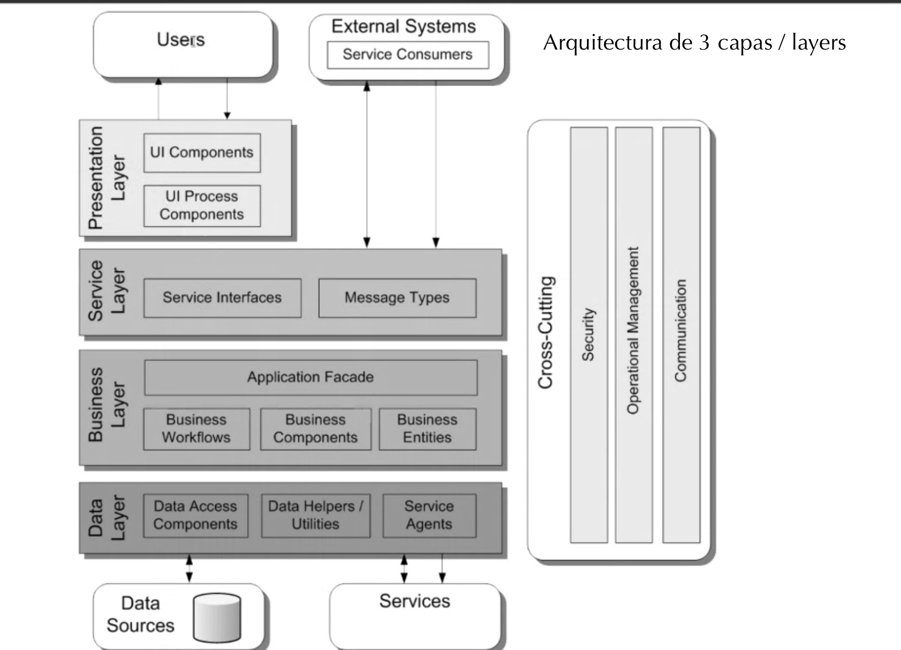

# **PROYECTO PYDEVOPS**
#### ***Ramón Sánchez & Leslie Aranibar***  *1r DAW DUAL* 
-------
$Índice:$

1. Introducción
   * Descripción del reto
   * Análisis de los objetivos   
2. Demostración del funcionamiento del proyecto
3. Descripción técnica
    * Arquitectura de la applicación por capas (de momento¿?)
    * Tecnologías utilizadas 
    * Diagrama de compontes y sus funcionalidades
    * Diagrama E/R de la base de datos (o el que proceda).??????????¿¿¿¿¿¿¿
    * Fichero XML y Schema ???¿¿¿¿ (donde saco el XMML)
4. Metodología de desarrollo utilizada
5. Clockify del desarrollo de la app (esto lo haré  al final porque seguimos inputando)
   * Diagrama del trabajo hecho
   * Análisis y justificación del tiempo invertido
6. Conclusiones 
  * Principales dificultades encontradas
   * Posibles mejoras 
7. Turno de preguntas
---
## **1. Introducción**

- $Descripción$ $del$ $Reto:$
  
El desafío que mi equipo abordó resolutivamente, en esencia, consiste en la refactorización de la web interna de una empresa determinada. La cuál era hecha con Wordpress y presentaba ciertas flaquezas. Sobretodo en los procesos de CRUD en su stock.

De manera que nosotros debemos de encargarnos de implementar un sistema de integración y entrega contínua (CI/CD) y mejorar, tanto el funcionamiento y la estética, de su web interna. Todo eso haciendo uso de los conocimientos adquiridos de Python, CSS y de BBDD.

Por suerte, el último becario pasó los ítems a documentos JSON. Y gracias a él, este es el punto de partida del trabajo de nuestro equipo.

- $Análisis$ $de$ $los$ $objetivos:$

Los objetivos clave de este proyecto son:

1. Desarrollar una applicación Python para extraer los datos de MongoAtlas, diseñando una especificación del esquema de los  documentos JSON. 
   
2. Otra aplicación Python que transforme los documentos JSON en ficheros Markdown.
3. Una tercera aplicación Python que sitúe los ficheros MD en la estructura de directorios que establece el generador de contenidos estáticos HUGO
4. Personalizar los estilos CSS para que la empresa disponga de una web única y hermosa. 
5. Implementar las funcionalidades de CRUD. Para que cualquier cambio que la empresa realice sobre un ítem de la base de datos se actualice automátiamente en su web simplemente lanzando el sistema que hemos desarrollado. 
---
## **2. Demostración del funcionamiento del proyecto**

A continuación ejecutaremos nuestro programa para demostrar que cumple con todos los objetivos vistos préviamente. Y satisfae las necesidades que demandaba la empresa. 

---
## **3. Descripción técnica**

  * $Arquitectura$ $de$ $la$ $applicación$ $por$ $capas:$ 
  

   * $Tecnologías$ $utilizadas:$

Para desarrollar el proyecto nosotros hemos hecho uso de las siguientes herramientas:
|      Herramientas     |                         Funcionalidad                         |
|:---------------------:|:-------------------------------------------------------------:|
| Visual Studio Code    | codificar                                                     |
| Linter en VSC         | visualizar errores                                            |
| Conventional Commits  | proporciona mas significado y legibilidad a los commits       |
| Git Hub               | para compartir y trabajar juntos                              |
| Git Graphs            | permite ver el historial y el esquema de las ramas de trabajo |
| Live Share            | codificar conjuntamente                                       |
| Black                 | corrector de la sintaxis de programación                      |
| Bandit                |                                                               |
| Tox                   |                                                               |
| Covarege              |                                                               |
| Hugo                  | gestor de sitios estáticos                                    |
| Python                | lenguaje de programación                                      |
| Mongo Atlas           | servicio global de base de datos de documentos en la nube     |
| Google Formularios    | para hacer formularios                                        |
| Discord               | conectarnos y hacer dailys                                    |

   * $Diagrama$ $de$ $compontes$ $y$ $sus$ $funcionalidades:$

---
 ## **4. Metodología de desarrollo utilizada**
---
## **5. Clockify del desarrollo de la app**
* $Diagrama$ $del$ $trabajo$ $hecho:$
* $Análisis$ $y$ $justificación$ $del$ $tiempo$ $invertido:$
---
## **6. Conclusiones**
* $Principales$ $dificultades$ $encontradas:$
* $Posibles$ $mejoras:$
---
## **7.Turno de preguntas**
